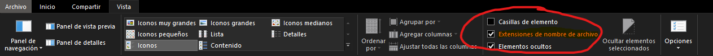
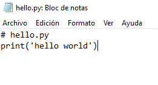

[Contenidos](../Contenidos.md) \| [Anterior (2 Variables, condicionales y ciclos)](02_Condicionales_Ciclos.md) \| [Próximo (4 Números)](04_Numeros.md)

# 1.3 Un primer programa

En esta sección vas a crear tu primer programa en Python, ejecutarlo y debuguearlo. Los programas en Python siempre son ejecutados en un intérprete de Python.

Antes de empezar te vamos a pedir que descargues el [archivo de clases](../Ejercicios.zip) si todavía no lo hiciste. Guardá ese archivo en una carpeta o directorio que elijas y descomprimilo (click derecho y "Extraer aquí"). Vas a ver una nueva carpeta donde dentro encontrarás muchas carpetas correspondientes a cada clase y una carpeta `Data` con archivos que vamos a ir utilizando más adelante.

Si estás en Windows, es probable que no puedas ver las extensiones de los archivos cuando uses el "Explorador de archivos" si nunca configuraste esa opción. Esto a veces puede traer confusiones si es tu primera vez trabajando con archivos. Para solucionarlo, hacé click en "Vista" en la barra o cinta de opciones que aparece arriba. Luego marcá la opción de "Extensiones de nombre de archivo" que aparece a la derecha:



A partir de ahora cuando te pidamos guardar programas o scripts, los vas a guardar en la carpeta correspondiente a la clase.

### Crear programas

Por convención, los programas escritos en Python se guardan en archivos `.py`.

```python
# hello.py
print('hello world')
```

Podés crear estos archivos con tu editor de texto favorito. Más adelante vamos a proponerles usar el `VS Code` que es un entorno de desarrollo integrado (IDE por «Integrated Development Environment», entorno de desarrollo integrado) que permite tener en la pantalla un editor y un intérprete al mismo tiempo, entre otras cosas. Pero por ahora usemos el block de notas, el gedit o tu editor favorito para seguir estos ejemplos.

### Ejecutar programas

Para ejecutar un programa escrito en Python se le pide al interprete de Python que lo lea y lo ejecute. Hacé esto desde la terminal con el comando `python` seguido del nombre del archivo a ejecutar.

1. Primero vamos a crear el archivo `hello.py` abriendo un editor de texto como el bloc de notas.
2. Escribimos las líneas que teníamos arriba.
   
3. Guardamos el archivo como `hello.py` en la carpeta `Clase01` dentro de `ejercicios_python\Clase01`.
   
4. Abrimos la consola de Linux, Windows o Mac. Si estás en Windows podes usar la terminal `cmd` que la podes encontrar usando la combinación de teclas `Win + R`, escribiendo `cmd` en la ventana que se abre y dándole a "Aceptar" o usar el buscador y buscarla ahí.
5. Luego tenemos que posicionarnos en la carpeta donde tenemos nuestro programa `hello.py`. Para eso tenemos que usar el comando `cd`.
6. Escribimos en la terminal `cd ruta_de_la_carpeta` reemplazando el argumento con la ruta donde vos tengas tu archivo. Por ejemplo, si yo tengo el archivo en el disco `D:`, primero tengo que posicionarme en el disco y luego acceder a la carpeta: `cd D:\ejercicios_python\Clase01`:
   

Una vez que estamos en la carpeta, escribimos alguno de los siguientes comandos dependiendo nuestro sistema operativo:

En una terminal Unix:

```bash
bash % python hello.py
hello world
bash %
```

O en una terminal de Windows escribiendo `hello.py` o `python hello.py` y ejecutando:

```
C:\ejercicios_python>hello.py
hello world

C:\ejercicios_python>c:\python36\python hello.py
hello world
```

en una terminal de Mac:

```
~/ejercicios_python
➜ python hello.py
hello world
```

Obervación: En Windows puede ser necesario especificar el camino (path) completo al intérprete de Python como en `c:\python36\python`. Si está bien instalado debería alcanzar con `python` , `python3` ó simplemente `py`.
Sin embargo, si Windows está bien configurado y Python está instalado del modo usual, debería alcanzar con que tipees el nombre del programa como en `hello.py` ó (por seguridad) `./hello.py`.

Tené en cuenta que con estos comandos estás corriendo el código de Python desde la línea de comandos de tu sistema operativo. El código se ejecuta, Python termina y el control vuelve a la terminal, saliendo de Python. Si necesitás ejecutarlo y seguir dentro del intérprete de Python podés usar `python -i hello.py`.

Si estás dentro del intérprete de Python y querés salir y volver a la línea de comandos, podés hacerlo mediante el comando `exit()`.

### Un ejemplo de programa

Resolvamos el siguiente problema:

> Una mañana ponés un billete en la vereda al lado del obelisco porteño. A partir de ahí, cada día vas y duplicás la cantidad de billetes, apilándolos prolijamente. ¿Cuánto tiempo pasa antes de que la pila de billetes sea más alta que el obelisco?

Acá va una solución (recordá escribir vos misme el programa en vez de copiar y pegar, esto ayuda muchísimo):

```python
# obelisco.py
grosor_billete = 0.11 * 0.001  # grosor de un billete en metros
altura_obelisco = 67.5         # altura en metros
num_billetes = 1               # variable donde acumulamos billetes
dia = 1                        # variable donde acumulamos días

while num_billetes * grosor_billete <= altura_obelisco:
    print(dia, num_billetes, num_billetes * grosor_billete)
    dia = dia + 1
    num_billetes = num_billetes * 2

print('Cantidad de días', dia)
print('Cantidad de billetes', num_billetes)
print('Altura final', num_billetes * grosor_billete)
```

Cuando lo ejecutás, la salida será la siguiente:

```bash
bash % python3 obelisco.py
1 1 0.00011
2 2 0.00022
3 4 0.00044
4 8 0.00088
5 16 0.00176
6 32 0.00352
...
19 262144 28.83584
20 524288 57.67168
Cantidad de días 21
Cantidad de billetes 1048576
Altura final 115.34336
```

Vamos a ir línea por línea qué es lo que está haciendo nuestro programa para poder comprender mejor cómo funciona:

1. `# obelisco.py` acá tenemos un comentario que python lo pasa por alto, no lo lee.
2. `grosor_billete = 0.11 * 0.001` acá le asignamos a la variable `grosor_billete` el valor del grosor de los billetes obtenido por una expresión matemática.
3. `altura_obelisco = 67.5` acá guardamos la altura del obelisco.
4. `num_billetes = 1` acá le asignamos a la variable `num_billetes` el número entero `1`. Esta variable la vamos a utilizar para que vaya acumulando billetes más adelante.
5. `dia = 1` lo mismo que `num_billetes`, solo que vamos a usar esta variable para ir acumulando días.
6. `while num_billetes * grosor_billete <= altura_obelisco:` en está línea estamos utilizando un ciclo `while` que lo que está haciendo es evaluar la siguiente condición: si la cantidad de billetes (`num_billetes`) multiplicada por el grosor de cada billete (`grosor_billete`) es menor o igual (`<=`) a la altura del obelisco (`altura_obelisco`). Entonces mientras esa condición se cumpla, va a realizar las acciones que tiene indentadas debajo.
7. `print(dia, num_billetes, num_billetes * grosor_billete)` esta es nuestra primer expresion que se ejecuta cuando se ejecuta el `while`. Acá le estamos pidiendo que imprima por pantalla el número de día en el que estamos (`dia`) seguido del número de billetes (`num_billetes`) y por último la altura que lleva nuestra torre de billetes obtenida por la expresión `num_billetes * grosor_billete`.
8. `dia = dia + 1` en esta línea le estamos diciendo a python que a la variable `dia` que teníamos en la línea 5, le sume `1`. Más precisamente lo que hacemos es decirle que a esa variable la **sobreescriba** con su mismo valor + 1, por eso volvemos a escribir `dia + 1`. A partir de ahora, esa variable vale 2 en la primer iteración (a cada ejecución de un ciclo se le llama iteración o repetición), luego valdrá 3, luego 4, así hasta que el `while` evalúe la condición asociada (línea 6) como `False`.
9. `num_billetes = num_billetes * 2` esta línea tiene el mismo espíritu que la anterior, solo que tiene una operación distinta: ahora en vez de sumar estamos multiplicando. Lo que hacemos acá es volver a asignarle a la variable `num_billetes` su mismo valor multiplicado por 2 porque recordemos que estamos agregando el doble de billetes por día.
   Además, esta variable es nuestra última expresión a ejecutar dentro del `while` y está asociada con la condición que tiene el `while` para poder seguir ejecutándose. Entonces en cada iteración está aumentando el número de billetes y al terminar esta expresión el `while` vuelve a evaluar su condición (línea 6) para saber si tiene que ser haciendo alguna acción. Si evalúa como `True` sigue, pero si evalúa como `False` como sucede en el día `21`, deja de accionar y nuestro programa se mueve a la siguiente línea de código.
10. `print('Cantidad de días', dia)` terminado el `while`, ahora le pedimos a nuestro programa que imprima la cantidad de días totales que precisamos para superar la altura del obelisco con nuestra torre de billetes.
11. `print('Cantidad de billetes', num_billetes)` imprime la cantidad de billetes necesitados para superar la altura del obelisco.
12. `print('Altura final', num_billetes * grosor_billete)` imprime la altura final de obelisco.
13. Fijarse que en la línea 10, 11 y 12 se imprimen números que no coinciden con los que imprime el `while` en su última iteración: `20 524288 57.67168`. Esto pasa porque en las acciones que le estábamos pidiendo que ejecute, el orden es el siguiente:

- Primero imprime por pantalla un resumen de los dias, la cantidad de billetes y la altura (línea 7). En la última iteración imprime: `20 524288 57.67168`
- Luego le suma `1` a la variable `dia`. Esto no lo imprime en el while, pero se ejecuta y `dia` ahora vale `21` en la última iteración.
- Luego multiplica los billetes. Esto tampoco lo imprime y también se ejecuta valiendo `1048576`.

Más adelante en esta sección vamos a usar este primer programa como ejemplo para aprender algunas cosas fundamentales sobre Python. Si todavía no quedaron claros algunos conceptos, no te preocupes, haciendo ejercicios se afianzan los conocimientos. Recordá tipear vos misme los códigos que veas acá, eso ayuda muchísimo, como así también colocar print a todo lo que hagas, paso a paso.

### Comandos

Un programa de Python es una secuencia de comandos:

```python
a = 3 + 4
b = a * 2
print(b)
```

Cada comando se termina con una nueva línea. Los comandos son ejecutados uno luego del otro hasta que el intérprete llega al final del archivo.

### Comentarios

Los comentarios son texto que no será ejecutado.

```python
a = 3 + 4
# Esto es un comentario
b = a * 2
print(b)
```

Los comentarios comienzan con `#` y siguen hasta el final de la línea.

### Imprimir en pantalla

La función `print` imprime una línea de texto con el valor pasado como parámetro.

```python
print('Hello world!') # Imprime 'Hello world!'
```

Podés imprimir variables. El texto impreso en ese caso será el valor de la variable y no su nombre.

```python
x = 100
print(x) # imprime el texto '100'
```

Si le pasás más de un valor al `print` los separa con espacios.

```python
nombre = 'Juana'
print('Mi nombre es', nombre) # Imprime el texto 'Mi nombre es Juana'
```

`print()` siempre termina la línea impresa pasando a la siguiente.

```python
print('Hola')
print('Mi nombre es', 'Juana')
```

Esto imprime:

```code
Hola
Mi nombre es Juana
```

El salto de línea entre ambos comandos puede ser suprimido o reemplazado (en este caso por un espacio):

```python
print('Hola', end=' ')
print('Mi nombre es', 'Juana')
```

Este código va a imprimir:

```code
Hola Mi nombre es Juana
```

### Ingreso de valores por teclado

Para leer un valor ingresado por el usuario, usá la función `input()`:

```python
nombre = input('Ingresá tu nombre:')
print('Tu nombre es', nombre)
```

`input` imprime el texto que le pases como parámetro y espera una respuesta. Es útil para programas pequeños, para hacer ejercicios o para debuguear un código. Casi no se lo usa en programas reales.

### El comando pass

A veces es conveniente especificar un bloque de código que no haga nada. El comando `pass` se usa para eso.

```python
if a > b:
    pass
else:
    print('No ganó a')
```

Este comando no hace nada. Sirve para guardar el lugar para un comando que querramos agregar luego.

## Ejercicios

Recordá descargar y descomprimir la carpeta [Ejercicios](../Ejercicios.zip).

### Ejercicio 1.4: Debuguear

El siguiente fragmento de código está relacionado con el problema del obelisco. Tiene un bug, es decir, un error.

```python
# obelisco.py

grosor_billete = 0.11 * 0.001 # 0.11 mm en metros
altura_obelisco = 67.5         # altura en metros
num_billetes = 1
dia = 1

while num_billetes * grosor_billete <= altura_obelisco:
    print(dia, num_billetes, num_billetes * grosor_billete)
    dia = dias + 1
    num_billetes = num_billetes * 2

print('Cantidad de días', dia)
print('Cantidad de billetes', num_billetes)
print('Altura final', num_billetes * grosor_billete)
```

Copiá y pegá el código que aparece arriba en un nuevo archivo llamado `obelisco.py`. Cuando ejecutes el código vas a obtener el siguiente mensaje de error que hace que el programa se detenga:

```code
Traceback (most recent call last):
  File "obelisco.py", line 10, in <module>
    dia = dias + 1
NameError: name 'dias' is not defined
```

Aprender a leer y entender los mensajes de error es una parte fundamental de programar en Python. Si tu programa _crashea_ (se rompe, da error) la última línea del mensaje de error indica el motivo. Un poco más arriba vas a ver un fragmento de código, un nombre de archivo y un número de línea que identifican el problema.

- ¿En qué linea está el error?
- ¿Cuál es el error?
- Repará el error.
- Ejecutá el programa exitosamente.

### Ejercicio 1.5: La pelota que rebota

Este es el primer conjunto de ejercicios en el que vas a tener que crear un archivo de Python y correrlo. A partir de aca, vamos a asumir que estás trabajando en el subdirectorio `ejercicios_python/`. Para ayudarte a organizar los archivos de diferentes clases y a ubicar el lugar correcto ya creamos algunos subdirectorios y un par de archivos en el directorio correpondiente a esta clase. Usando los comandos de la terminal de tu sistema operativo buscá el archivo `ejercicios_python/Clase01/rebotes.py`. Lo vamos a usar en este ejercicio.

Una pelota de goma es arrojada desde una altura de 100 metros y cada vez que toca el piso salta 3/5 de la altura desde la que cayó. Escribí un programa `rebotes.py` que imprima una tabla mostrando las alturas que alcanza en cada uno de sus primeros diez rebotes.

Tu programa debería generar una tabla que se parezca a esta:

```code
1 60.0
2 36.0
3 21.599999999999998
4 12.959999999999999
5 7.775999999999999
6 4.6655999999999995
7 2.7993599999999996
8 1.6796159999999998
9 1.0077695999999998
10 0.6046617599999998
```

_Nota: Podés limpiar un toque la salida si usás la función round() de la que miraste el help hace un rato. Tratá de usarla para redondear a cuatro dígitos después del punto decimal._

```code
1 60.0
2 36.0
3 21.6
4 12.96
5 7.776
6 4.6656
7 2.7994
8 1.6796
9 1.0078
10 0.6047
```

### Ejercicio 1.6: Saludos

Escribí un programa llamado `saludo.py` que pregunte el nombre de le usuarie, imprima un saludo (por ejemplo, "Hola, Juana") y termine.

[Contenidos](../Contenidos.md) \| [Anterior (2 Variables, condicionales y ciclos)](02_Condicionales_Ciclos.md) \| [Próximo (4 Números)](04_Numeros.md)
